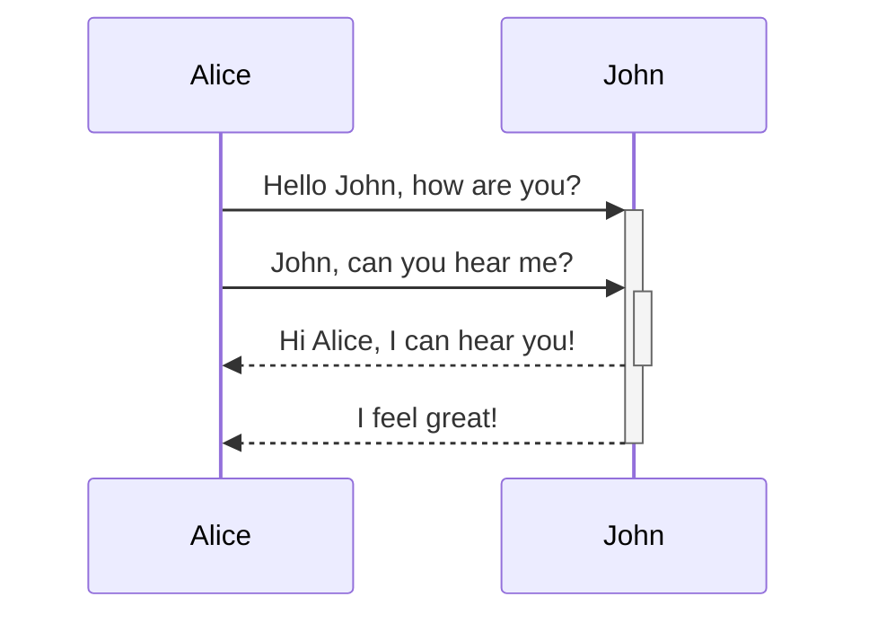

#### New syntax for advanced slides
##### Fragmented list (ordered and unordered)

Fragmented list is list but presents out one after another upon clicking 'next page' in slides - fragmented annotation

```md
# Unordered list

- First
- Second
- Third

---

# Fragmented unordered list

- Permanent
+ First
+ Second
+ Third

---

# Ordered list

1. First
2. Second
3. Third

---

# Fragmented ordered list

1. Permanent
2) Second
3) Third
4) Fourth
```

##### Link between slides

```md
External Links

http://obsidian.md - automatic!

[Obsidian](http://obsidian.md)

---

Obsidian URI links

[Link to note](obsidian://open?path=D:%2Fpath%2Fto%2Ffile.md)

[Link to note](obsidian://open?vault=MainVault&file=MyNote.md)

---
<!-- .slide: id="InternalLinks" -->
Internal Links

This [[Internal link]] will be displayed as normal text

This [[Internal link|Link]] will use its alias for displaying

---

Slide Links

You can link between slides, [like this](#/1/0).

Or by slide id, [like this](#InternalLinks).

```

##### Embeds

Given a md file exists, e.g. 'Obsidian.md'

```md
# Notes about Obsidian
A knowledge base that works on local Markdown files

# Link
Link to Obsidian Homepage: http://obsidian.md
```

Slides md file 'Slides.md' can be written as below to have the embeds:

```md
![[Obsidian]]

---

![[Obsidian#Link]]
```

##### Mermaid

For inserting various diagrams e.g. Sequence diagram, git graph etc.

```md
---
theme: beige
highlightTheme: css/vs2015.css

---



##### Callouts

##### Horizontal vs. Vertical slides

- 3 dashes for horizontal moving slides
- 2 dashed for vertical moving slides

```md
# Slide 1

---

# Slide 2.1 (being reached horizontally)

--

# Slide 2.2 (being reached vertically)
```

##### Element annotations to decorate text (text only??)

- class
- style
- data-toggle
##### Slides annotation to decorate the entire slide page

```md
<!-- .slide: style="background-color: coral;" -->

# Header with coral background color

Paragraph has coral background color, too!

---

<!-- .slide: style="background-color: green;" -->

- All Bullet points
- have green
- background color
```

##### Block comments

To **logically** define a group in a slides, also you can apply style for a block in the slides, see [[Demo Block Comments]]

##### Fragments

Animated presenting of item in slides, animation is defined in `<!-- element class="" -->`, see [[Demo Fragments]]

##### Define custom style -- inline styling

```md
<style>
	.with-border{
		border: 1px solid red;
	}
</style>

styled text <!-- element class="with-border" -->

```


##### Slides background

```md
<!-- slide bg="aquamarine" -->
## Slide with text based background
---

<!-- slide bg="#ff0000" -->
## Slide with hex based background

---

<!-- slide bg="rgb(70, 70, 255)" -->
## Slide with rgb based background

---

<!-- slide bg="hsla(315, 100%, 50%, 1)" -->
## Slide with hsl based background

---

# Slide without background

---

<!-- slide bg="https://picsum.photos/seed/picsum/800/600" -->
## Slide with image background

---

<!-- slide bg="[[image.jpg]]" -->
## Slide with image background #2

---

<!-- slide bg="https://picsum.photos/seed/picsum/800/600" data-background-opacity="0.5" -->
## with opacity

0.5 ≙ 50% opacity

---

## More options:

See [reveal backgrounds](https://revealjs.com/backgrounds/)

```

##### Icons

e.g. ``

You can manipulate the icon's size, color, rotation, animation, position/alignment

##### Charts with reveal js

```md
```chart
    type: bar
    labels: [Monday,Tuesday,Wednesday,Thursday,Friday, Saturday, Sunday, "next Week", "next Month"]
    series:
      - title: Title 1
        data: [1,2,3,4,5,6,7,8,9]
      - title: Title 2
        data: [5,4,3,2,1,0,-1,-2,-3]
    ```
```

##### Slides animation with reveal js

```md
<!-- .slide: data-auto-animate -->
# Title

---
<!-- .slide: data-auto-animate -->

# Title
##### **Subtitle**
###### *Author - 2022* 

```